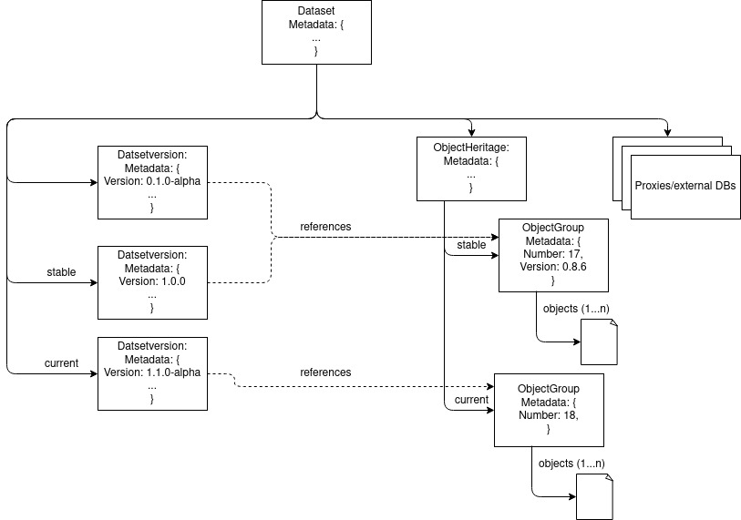

# Documentation
Design documentation for the ScienceObjectsDB. Technical documentation can be found in the implementation repositories.

## Design overview
### Internal design

Dataset: Basic unit to organize stored data. Ownes the data objects (which are hierarchical ordered) and has version that bundle data objects. In addition it can link to external databases and/or proxies.

DatasetVersion: A specific version of a dataset. The version number follows semantic versionining principles. Can have additional tags like "stable", "current" or "dev"

ObjectHeritage: A lineage of ObjectGroups that track their provenance. This is used to track changes in closely related files, that essentially form a version history.

ObjectGroup: A group of binary objects that hold 1..n closely related binary objects (e.g. a file and a coressponding index). They are bound to an ObjectHeritage that track updates and can optionally be versioned. An object group is immutable and can only be deleted, but not updated. Delta patching is intended to be supported, but will create a new ObjectGroup

### Implementation design
* MongoDB will be used as storage backend
* The storage service will be implemented in Golang
* The interface will be defined using gRPC
* Based on the gRPC implementation a JSON-over-HTTP will be offered using grpc-gateway
* Clients stubs will be generated for major programming languages