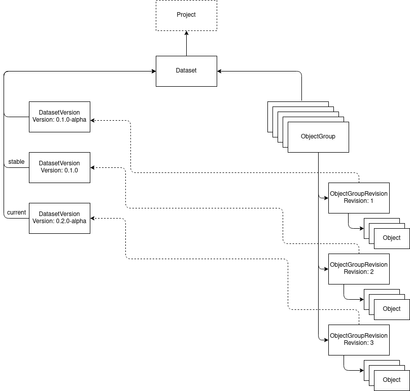

# Documentation
Design documentation for the ScienceObjectsDB. Technical documentation can be found in the implementation repositories.

## Design overview
### Internal data structure layout

### Dataset
Basic unit to organize stored data. Ownes the data objects (which are hierarchical ordered) and has version that bundle data objects. In addition it can link to external databases and/or proxies.

### DatasetVersion
A specific version of a dataset. The version number follows semantic versionining principles. Can have additional tags like "stable", "current" or "dev" that link to a specific version and can be updated and separately queried.

### ObjectGroup
Represents a group of objects. The individual objects can have multiple, optionally versioned, revisions that can be linked by DatasetVersion. A revision is an immutable piece of data that can not be modified, only created and deleted.

### ObjectGroupVersion
Represents a specific, optionally versioned set of objects that is linked to an object group.

### Object
An individual object that e.g. represents a file. Usually stored in the associated object storage but can also be a virtual link to an external data object e.g. in a reference database.

### Implementation design
* MongoDB will be used as storage backend
* The storage service will be implemented in Rustlang
* The interface will be defined using gRPC
* Based on the gRPC implementation a JSON-over-HTTP will be offered using grpc-gateway
* Clients stubs will be generated for major programming languages

## Implementations
API: https://github.com/ScienceObjectsDB/API

Server: https://github.com/ScienceObjectsDB/CORE-Rust-Server

Rust-API: https://github.com/ScienceObjectsDB/rust-api

Golang-API: https://github.com/ScienceObjectsDB/go-api

Java-API: https://github.com/ScienceObjectsDB/java-api

### Authentication
## Production
Currently only oauth2 is supported for authentication.
A valid oauth2 access token needs to be provided. In the gRPC API it needs to be added in the metadata of each call with the key "AccessToken"