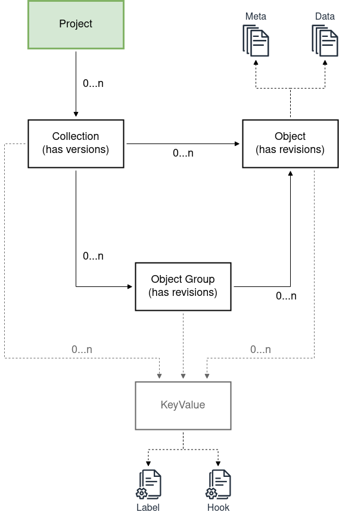

# Documentation

This repository contains the general documentation for the Aruna Object Storage (AOS).

This includes theoretical concepts, the internal data structure, the entity-relationship model, a basic usage guide, some generic user story playbooks, and much more in the future.

Deeper technical documentation can be found in the implementation repositories.
Details on the individual structures can be found in the API documentation and/or the [Internal data structure](get_started/internal_data_structure) part of this repository.

## Repository Content Overview

* [Theoretical concepts:](concepts)
    * [Authorization](concepts/authz)
    * [Multi-Cloud](concepts/multicloud)
    * [Storage](concepts/storage)
* [Internal data structure](get_started/internal_data_structure)
* [Basic usage](get_started/basic_usage)
* [Generic use case playbooks](get_started/generic_playbooks)

## Design overview

### Internal data structure layout overview

A more detailed description of the individual parts can be found [here](get_started/internal_data_structure/internal_data_structure.md).

## AOS Components

<dl>
  <dt>API</dt>
  <dd>API definition of the AOS server</dd>

  <dt>AOS Server</dt>
  <dd>The implementation of the API that handles the incoming requests</dd>

  <dt>AOS Data Proxy</dt>
  <dd>Internal server implementation handling the communication with the data storage backend used for the specific AOS instance.</dd>
</dl>

## Notification system

The storage system has a notification system that can be used to receive change notification on specific resources.
An example can be found here: [Notification Stream Example](#)

## Implementations

### Implementation design

- An RDBMS will be used as database backend for the AOS-Server
- The storage service and the data proxy will be implemented in Rust
- The interface will be defined using gRPC
- Based on the gRPC implementation a JSON-over-HTTP will be offered using grpc-gateway
- [Clients stubs](#API) will be generated for major programming languages
- A basic CLI client will be offered to simplify the usage entry barrier

### API

https://github.com/ArunaStorage/ArunaAPI

* Rust API stubs: [GitHub](https://github.com/ArunaStorage/rust-api) or [crates.io](https://crates.io/crates/aruna-rust-api)
* Go API stubs: [GitHub](https://github.com/ArunaStorage/go-api)
* Python API stubs: [GitHub](https://github.com/ArunaStorage/python-api)
* Java API stubs: [GitHub](https://github.com/ArunaStorage/java-api)

### Server

https://github.com/ArunaStorage/ArunaServer

> Aruna Object Storage is data lake application with API that manages scientific data objects according to FAIR principles.
It interacts with multiple data storage backends (e.g. S3, File ...) via the DataProxy application and stores a rich and queryable set of metadata about stored objects in a
postgres compatible database (e.g. CockroachDB).
Aruna is conceptually geo-redundant with multiple dataset and database locations. Users can choose where and how to store their data.

### CLI/API client:

https://github.com/ArunaStorage/ArunaCLI

> This is a simple CLI application for the ScienceObjectsDB API. Its currently work in progress and will be developed along with the API. Neither concept nor implementation are final.

<!--
    Simple example: [golang example](https://github.com/ScienceObjectsDB/go-api/blob/main/examples/upload.go)
    
    1. Get Auth token
        1. Create Project
        2. Get APIToken from website (key symbol)
    2. Install [client](#implementations) for your language or build it yourself
    3. Create dataset
    4. Create ObjectGroups with Objects, a revision will be created automatically.
    5. Create Uploadlinks and upload data (either during objectgroup creation of via additional call)
    6. Finish object upload
-->

### Authentication

> Coming soon.

## Production

> Coming soon. 

<!--
  Currently only oauth2 is supported for authentication.
  A valid oauth2 access token needs to be provided.
  In the gRPC API it needs to be added in the metadata of each call with the key "AccessToken".
  For APIToken please use the key API_TOKEN. An API_Token can be obtained from the website.
  In order to login you need to be part of the scienceobjectsgroup.
-->
