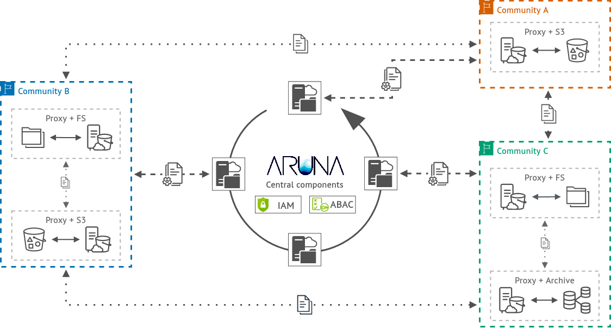

# Documentation

This repository contains the general documentation for Aruna - The Data Orchestration Engine.

It includes a basic usage guide with lots and lots of API examples, information about the internal data structure and much more in the future such as theoretical concepts, the database entity-relationship model and some generic user story playbooks.

Deeper technical documentation can be found in the implementation repositories for the [API](#api) and the [main components](#aruna-data-orchestration-engine).
Details on the individual structures can be found in the API documentation and/or the [Internal data structure](https://arunastorage.github.io/documentation/latest/internal_data_structure/internal_data_structure/) part of this repository.

[**🌐 The complete Aruna documentation is available via GitHub Pages 🌐**](https://ArunaStorage.github.io/documentation/latest)

## Concept

Aruna is a cloud-native, geo-redundant, scalable, and domain-agnostic object storage based data mesh system that orchestrates scientific data and a rich set of associated metadata according to FAIR principles.  

Aruna is implemented in Rust and provides multiple access methods for end users, such as a gRPC and JSON-over-REST API, as well as pre-built client libraries for multiple programming languages. The system uses an underlying distributed NewSQL database to manage detailed information about its [resources](https://arunastorage.github.io/documentation/latest/internal_data_structure/internal_data_structure/). The database can be deployed across multiple data centers and scaled horizontally to keep pace with the growth of the data stored. Data submitted by users is stored using data proxies, which provide an S3-compatible API with additional functionality to abstract from existing storage infrastructures. This allows a variety of different academic computing and storage providers to be integrated into the system, enabling easy and automated offsite backups and site-local caches, while allowing participants to retain full data sovereignty.

All data uploaded and stored by users is stored as an Object, represented as a sequence of bytes without any semantic information. Once uploaded, these Objects are immutable. Updates create new Objects that reference the original Object, resulting in a history of changes. Objects are organized into Project with optional Collections and Datasets. A Dataset consists of closely related Objects and is used to combine data and metadata for easier access and organization. Collections and Projects, on the other hand, contain a set of Objects and Datasets that represent a scoped view of the data. Collections, Datasets and Projects can also be snapshotted, capturing the current state and providing a persistent, versioned identifier. This allows other researchers to accurately reproduce results based on a specific version, while allowing for continuous modification of the current data. All resources and their relationships form a directed acyclic graph (DAG) with Projects as roots and Objects as leaves.

<figure id="aruna-components">
  <picture>
    <source media="(prefers-color-scheme: dark)" srcset="./docs/internal_data_structure/aruna_components.dark.png">
    <source media="(prefers-color-scheme: light)" srcset="./docs/internal_data_structure/aruna_components.png">
    
  </picture>
  <figcaption align="center">
    
<em>Schematic overview of centralised and decentralised Aruna components. The centralised Aruna components handle authentication and authorisation by integrating existing IAM providers in combination with user-specific attributes (ABAC). The central components also provide a registry with meta-descriptions and locality information making records discoverable. The decentralised components consist of data proxy applications that expose existing data structures via a common S3 interface and enable data exchange and caching in a peer to peer network within and between participants.</em>

  </figcaption>
</figure>

## Components

### **API**

[**Github repo**](https://github.com/ArunaStorage/api)

> This repo contains the definitions of the Aruna Object Storage (AOS) API. It is written in the protocol-buffers interface definition language (IDL). This can be used to automatically generate clients in many different programming languages using the grpc framework.

> With the release of a new API version, the client libraries are automatically compiled and updated to the latest version.
> The API is fundamentally backwards compatible, which means that users' applications will continue to work as usual before they also decide to move to the new version.

* Rust API stubs: [GitHub](https://github.com/ArunaStorage/api) or [crates.io](https://crates.io/crates/aruna-rust-api)
* Go API stubs: [GitHub](https://github.com/ArunaStorage/go-api)
* Python API stubs: [GitHub](https://github.com/ArunaStorage/python-api) or [PyPI](https://pypi.org/project/Aruna-Python-API)
* Java API stubs: [GitHub](https://github.com/ArunaStorage/java-api) or [GitHub Packages](https://github.com/ArunaStorage/java-api/packages/)

### **Aruna Data Orchestration Engine**

[**Github repo**](https://github.com/ArunaStorage/aruna){:target="_blank"}

The implementation of the Server, that handles the incoming requests, and DataProxy, that handles the communication between the data storage backend and Aruna.

> Aruna is a geo-redundant data orchestration engine that manages scientific data and a rich set of associated metadata according to FAIR principles.

> It supports multiple data storage backends (e.g. S3, File ...) via data proxies that expose an S3-compatible interface. The main server handles metadata, user and resource hierarchies while the data proxies handle the data itself. Data proxies can communicate with each other in a peer-to-peer-like network and share data.

> This repository is split into two components, the server and the data proxy.

> * FAIR, geo-redundant, data storage for multiple scientific domains
> * Decentralized data storage system
> * Data proxy specific authorization rules to restrict access on the data side
> * Data proxy ingestion that can integrate existing data collections
> * Organization of your data objects into projects, collections and datasets
> * Flexible, file format and data structure independent metadata annotation via labels and dedicated metadata files (e.g. schema.org)
> * Notification streams for all actions performed
> * Compatible with multiple (existing) data storage architectures (S3, File, ...)
> * S3-compatible API for pre-authenticated upload and download URLs
> * REST-API and dedicated client libraries for Python, Rust, Go and Java
> * Hook system to integrate external workflows for data validation and transformation
> * Dedicated rule system to handle custom server-side authorization

## Implementation design trivia

- A distributed NewSQL RDBMS will be used as database backend for the AOS Server
- The AOS Server, DataProxy and CLI are implemented in [Rust](https://www.rust-lang.org/)
- The base API interface is defined using [Protocol Buffers](https://developers.google.com/protocol-buffers)
- All endpoints work with JSON over HTTP just as they would do with requests made via gRPC from individual clients
- [Client stubs](#aos-api) will be generated for major programming languages on every API release ([listed here](#api))
- A [web UI](https://dev.aruna-storage.org) is available for demonstration purposes
- A CLI client will be offered in the future to simplify the usage entry barrier