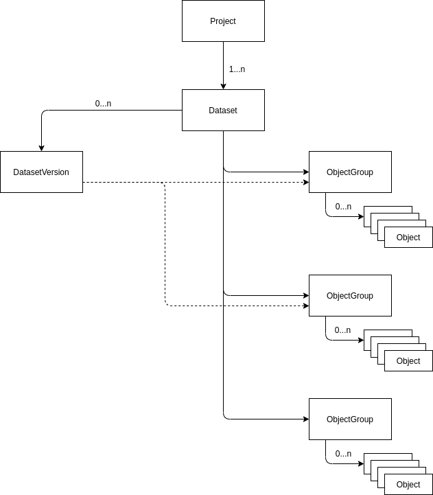

# Documentation

Design documentation for the ScienceObjectsDB. Technical documentation can be found in the implementation repositories. Details on the individual structures can be found in the API documentation.

## Get started

### After deployment

#### CLI/API client

Simple example: [golang example](https://github.com/ScienceObjectsDB/go-api/blob/main/examples/upload.go)

1. Get Auth token
   1. Create Project
   2. Get APIToken from website (key symbol)
2. Install [client](#implementations) for your language or build it yourself
3. Create dataset
4. Create ObjectGroups with Objects
5. Create Uploadlinks and upload data (either during objectgroup creation of via additional call)
6. Finish object upload

## Design overview

### Internal data structure layout

### Dataset

Basic unit to organize stored data. Ownes the data objects (which are hierarchical ordered) and has version that bundle data objects. In addition it can link to external databases and/or proxies.

### DatasetVersion

A specific version of a dataset. The version number follows semantic versionining principles. Can have additional tags like "stable", "current" or "dev" that link to a specific version and can be updated and separately queried.

### ObjectGroup

Represents a tightly coupled group of objects, e.g. a data file and a corresponding index. It can be thought of as a directory.

### Object

An individual object that e.g. represents a file. Usually stored in the associated object storage but can also be a virtual link to an external data object e.g. in a reference database.

### Implementation design

- An RDBMS will be used as database backend for the CORE-Server
- The storage service will be implemented in Golang
- The interface will be defined using gRPC
- Based on the gRPC implementation a JSON-over-HTTP will be offered using grpc-gateway
- Clients stubs will be generated for major programming languages

## Components

- API: API of the CORE-Server
- CORE-Server: The implementation of the API that stores the actual data objects

## Implementations

API: https://github.com/ScienceObjectsDB/API

Server: https://github.com/ScienceObjectsDB/CORE-Server

Rust-API: [cargo](https://crates.io/crates/scienceobjectsdb_rust_api) or [github](https://github.com/ScienceObjectsDB/rust-api)

Golang-API: https://github.com/ScienceObjectsDB/go-api

Java-API: https://github.com/ScienceObjectsDB/java-api

### Authentication

## Production

Currently only oauth2 is supported for authentication.
A valid oauth2 access token needs to be provided. In the gRPC API it needs to be added in the metadata of each call with the key "AccessToken". For APIToken please use the key API_TOKEN. An API_Token can be obtained from the website. In order to login you need to be part of the scienceobjectsgroup.
