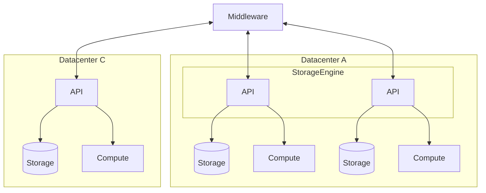

```mermaid
    flowchart TB;
        Middleware <--> APIA
        Middleware <--> APIB
        Middleware <--> APIC
    subgraph Datacenter[Datacenter A]
        direction BT;
            subgraph StorageEngine[StorageEngine]
                direction BT;
                APIA[API]
            end
        APIA[API]-->StorageA[(Storage)];
        APIA[API]-->ComputeA[Compute];
    end
    subgraph Datacenter[Datacenter B]
        direction BT;
            subgraph StorageEngine[StorageEngine]
                direction BT;
                APIB[API]
            end
        APIB[API]-->StorageB[(Storage)];
        APIB[API]-->ComputeB[Compute];
    end
    subgraph Datacenter C
        APIC[API]-->StorageC[(Storage)];
        APIC[API]-->ComputeC[Compute];
    end

    style Datacenter fill:#377baf
    style StorageEngine fill:#215074
```
