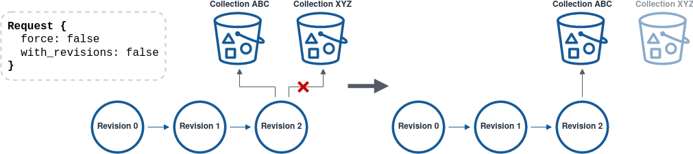
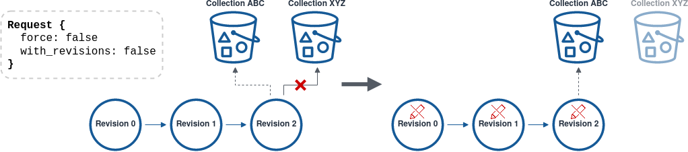
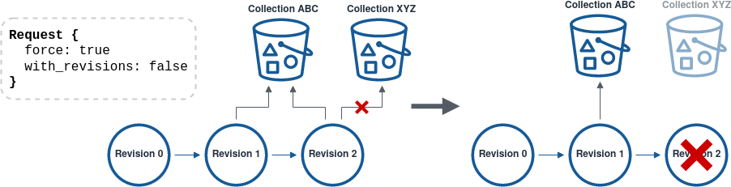

# How to use the Object API / ObjectServiceClient

## Introduction

Objects are the primary resource to actually hold the data you upload. 

In any case, Objects need at least a Project that acts as the root of their hierarchy. However, this project does not have to be the direct parent, but objects can also be attached below a collection or a dataset by specifying the latter as the parent during creation.

If you don't know how to create other hierarchical resources you should read the previous chapters on how to use the [**Project API**](04_How-To-Project.md), [**Collection API**](05_How-To-Collections.md) and/or [**Dataset API**](06_How-To-Datasets.md).


## Initialize Object

The first step is to initialize an Object.
This creates an Object in the AOS with a status of _Initializing_ which marks it as a _Staging Object_.
As long as an Object is in the staging area data can be uploaded to it.

??? Tip "Hash validation"

    If you provide a SHA256 and/or MD5 hash with the initializing of an Object it will be automatically validated by 
    the DataProxy after the data upload has been finished. This ensures that the upload was successful and complete. 

??? Abstract "Required permissions"

    This request requires at least APPEND permission on the parent resource in which the Object is to be created.

=== ":simple-curl: cURL"

    ```bash linenums="1"
    # Native JSON request to create a new Object
    curl -d '
      {
        "name": "aruna.png",
        "description": "My demo Object",
        "keyValues": [],
        "relations": [],
        "dataClass": "DATA_CLASS_PUBLIC",
        "projectId": "<project-id>",
        "collectionId": "<collection-id>",
        "datasetId": "<dataset-id>",
        "hashes": [
            {
            "alg": "HASHALGORITHM_SHA256",
            "hash": "5839942d4f1e706fee33d0837617163f9368274a72b2b7e89d3b0877f390fc33"
            }
        ],
        "metadataLicenseTag": "CC-BY-4.0",
        "dataLicenseTag": "CC-BY-4.0"
      }' \
         -H 'Authorization: Bearer <AUTH_TOKEN>' \
         -H 'Content-Type: application/json' \
         -X POST https://<URL-to-AOS-instance-API-gateway>/v2/object
    ```

=== ":simple-rust: Rust"

    ```rust linenums="1"
    // Create tonic/ArunaAPI request to create a new Object
    let request = CreateObjectRequest {
        name: "aruna.png".to_string(),
        description: "My demo Object".to_string(),
        key_values: vec![],
        relations: vec![],
        data_class: DataClass::Public as i32,
        hashes: vec![Hash {
            alg: Hashalgorithm::Sha256 as i32,
            hash: "5839942d4f1e706fee33d0837617163f9368274a72b2b7e89d3b0877f390fc33".to_string(),
        }],
        metadata_license_tag: "CC-BY-4.0".to_string(),
        data_license_tag: "CC-BY-4.0".to_string(),
        parent: Some(Parent::ProjectId("<project-id>".to_string())),
    };
    
    // Send the request to the AOS instance gRPC gateway
    let response = object_client.create_object(init_request)
                                .await
                                .unwrap()
                                .into_inner();
    
    // Do something with the response
    println!("{:#?}", response);
    ```

=== ":simple-python: Python"

    ```python linenums="1"
    # Create tonic/ArunaAPI request to create a new Object
    request = CreateObjectRequest(
        name="aruna.png",
        description="My demo Object",
        key_values=[],
        external_relations=[],
        data_class=DataClass.DATA_CLASS_PUBLIC,
        project_id="<project-id>",
        collection_id="<collection-id>",
        dataset_id="<dataset-id>",
        hashes=[Hash(
            alg=Hashalgorithm.HASHALGORITHM_SHA256,
            hash="5839942d4f1e706fee33d0837617163f9368274a72b2b7e89d3b0877f390fc33"
        )],
        metadata_license_tag="CC-BY-4.0",
        data_license_tag="CC-BY-4.0"
    )

    # Send the request to the AOS instance gRPC gateway
    response = client.object_client.CreateObject(request=request)

    # Do something with the response
    print(f'{response}')
    ```


## Upload data to a Staging Object

After initializing an Object you can request an upload url with the object id you received from the initialization.
Data then can be uploaded through the received url to the AOS data proxy.

If the data associated with the Object is greater than 5 Gigabytes you have to request a _multipart_ upload and chunk your data in parts which are at most 5 Gigabytes in size.
You also have to request an upload url for each part individually.

!!! Tip "S3 Presigned download URL"

    You can also generate presigned URLs on your own for the specific AOS DataPoxy you want to upload the Object data to.

??? Abstract "Required permissions"

    Requesting an upload URL needs at least APPEND permissions on the Object's Collection or the Project under which the Collection is registered.

### Single part upload

!!! Info

    **Single part upload automatically starts the finishing process of the respective Object once the upload has been finished to make it available.**

=== ":simple-curl: cURL"

    ```bash linenums="1"
    # Native JSON request to request an upload url for single part upload
    curl -H 'Authorization: Bearer <AUTH_TOKEN>' \
         -H 'Content-Type: application/json' \
         -X GET https://<URL-to-AOS-instance-API-gateway>/v2/object/{object-id}/upload
    
    # Native JSON request to upload single part data through the generated data proxy upload url
    curl -X PUT -T <path-to-local-file> <upload-url>
    ```

=== ":simple-rust: Rust"

    ```rust linenums="1"
    // Create tonic/ArunaAPI request to request an upload url for single part upload
    let get_request = GetUploadUrlRequest {
        object_id: "<object-id>".to_string(),
        multipart: false,
        part_number: 1,
    };
    
    // Send the request to the AOS instance gRPC gateway
    let response = object_client.get_upload_url(request)
                                .await
                                .unwrap()
                                .into_inner();
    
    // Do something with the response
    println!("{:#?}", response);
    let upload_url = response.url;
    
    // Upload local file to the generated upload URL
    let path = Path::new("/path/to/local/file");
    let file = std::fs::File::open(path).await.unwrap();
    
    let client = reqwest::Client::new();
    let stream = FramedRead::new(file, BytesCodec::new());
    let body   = Body::wrap_stream(stream);
    
    // Send the request to the upload url
    let response = client.put(upload_url)
                         .body(body)
                         .send()
                         .await
                         .unwrap();
    
    // Do something with the response
    println!("{:#?}", response);
    ```

=== ":simple-python: Python"

    ```python linenums="1"
    # Create tonic/ArunaAPI request to request an upload url for single part upload
    request = GetUploadURLRequest(
        object_id="<object-id>",
        multipart=False,
        part_number=1
    )

    # Send the request to the AOS instance gRPC gateway
    response = client.object_client.GetUploadURL(request=request)

    # Do something with the response
    print(f'{response}')
    upload_url = response.url

    # Upload local file to the generated upload URL
    file_path = "/path/to/local/file"
    headers = {'Content-type': 'application/octet-stream'}
    upload_response = requests.put(upload_url, data=open(file_path, 'rb'), headers=headers)

    # Do something with the response
    print(f'{upload_response}')
    ```


### Multipart upload

For each uploaded part of the multipart upload you will receive a so called `ETag` in the response header which has to be saved with the correlating part number for the Object finishing.

**Numbers of upload parts start with 1, not 0.**

**Multipart uploads have to be [finished manually](#finish-object) as the DataProxy cannot know or guess how many parts will be uploaded in total.**

!!! Tip

    Upload of parts from multipart upload can be uploaded parallel.

!!! Warning

    **If the data is stored in an S3 endpoint individual parts of multipart upload have to be at least 5MiB in size (5242880 bytes) or the Object finishing will fail. This limitation is part of the official S3 multipart upload specification.**

=== ":simple-curl: cURL"

    ```bash linenums="1"
    # Native JSON request to request an upload url for specific part of multipart upload
    curl -H 'Authorization: Bearer <AUTH_TOKEN>' \
         -H 'Content-Type: application/json' \
         -X GET 'https://<URL-to-AOS-instance-API-gateway>/v2/object/{object-id}/upload?multipart=true&partNumber=<part-number>'
    
    # Upload multipart data with native JSON requests through the generated data proxy upload urls
    curl -X PUT -T <path-to-local-file> <upload-url>
    ```

=== ":simple-rust: Rust"

    ```rust linenums="1"
    // Create tonic/ArunaAPI to request an upload url for specific part of multipart upload
    let request = GetUploadUrlRequest {
        object_id: "<object-id>".to_string(),
        multipart: true,
        part_number: <part-number> as i32,
    };
    
    // Send the request to the AOS instance gRPC gateway
    let response = object_client.get_upload_url(request)
                                .await
                                .unwrap()
                                .into_inner();
    
    // Do something with the response
    println!("{:#?}", response);
    ```

=== ":simple-python: Python"

    ```python linenums="1"
    # Create tonic/ArunaAPI request to request an upload url for specific part of multipart upload
    request = GetUploadURLRequest(
        object_id="<object-id>",
        multipart=True,
        part_number=<part-number>
    )

    # Send the request to the AOS instance gRPC gateway
    response = client.object_client.GetUploadURL(request=request)

    # Do something with the response
    print(f'{response}')
    ```


#### Multipart upload example

=== ":simple-curl: cURL"

    ```bash linenums="1"
    OBJECT_ID=<staging-object-id>
    
    # Loop over all file parts, request an upload url, upload the data and display ETag with its part number
    for i in "Dummy_Archive.tar.gz.aa",1 "Dummy_Archive.tar.gz.ab",2 "Dummy_Archive.tar.gz.ac",3 "Dummy_Archive.tar.gz.ad",4; 
      do IFS=","; # Split input at comma
      set -- $i;  # Convert the "tuple" into the param args $1 $2 ...
        PART_FILE=$1
        PART_NUM=$2
    
        UPLOAD_URL=$(curl -s -H 'Authorization: Bearer <AUTH_TOKEN>' \
                             -H 'Content-Type: application/json' \
                             -X GET "https://<URL-to-AOS-instance-API-gateway>/v2/object/${OBJECT_ID}/upload?multipart=true&partNumber=${PART_NUM}" | jq -r '.url')
        ETAG=$(curl -X PUT -T ${PART_FILE} -i "${UPLOAD_URL}" | grep etag)
    
        echo -e "\nPart: ${PART_NUM}, ETag: ${ETAG}\n"
    done
    ```

=== ":simple-rust: Rust"

    ```rust linenums="1"
    let mut file = tokio::fs::File::open("/path/to/local/file").await.unwrap();     // File handle
    let mut remaining_bytes: usize = file.metadata().await.unwrap().len() as usize; // File size in bytes
    let mut upload_part_counter: i64 = 0; 
    let mut completed_parts: Vec<CompletedPart> = Vec::new();
    
    const UPLOAD_BUFFER_SIZE: usize = 1024 * 1024 * 50; // 50MiB chunks
    let mut buffer_size = UPLOAD_BUFFER_SIZE;           // Variable buffer size for loop
    
    loop {
        // Increment part number
        upload_part_counter += 1;
        
        // Set buffer size
        if remaining_bytes < UPLOAD_BUFFER_SIZE {
            buffer_size = remaining_bytes;
        }
    
        // Fill buffer with bytes from file
        let mut data_buf = vec![0u8; buffer_size];
        let successful_read = file.read_exact(&mut data_buf).await;

        match successful_read {
            Ok(bytes) => bytes,
            Err(_) => file.read_to_end(&mut data_buf).await.unwrap(),
        };

        // Create tonic/ArunaAPI request to request an upload url for multipart upload part
        let upload_url = object_client
            .get_upload_url(GetUploadUrlRequest {
                object_id: object_id.to_string(),
                multipart: true,
                part_number: upload_part_counter as i32,
            })
            .await
            .unwrap()
            .into_inner()
            .url;

        // Upload buffer content to upload url and parse ETag from response header
        let client   = reqwest::Client::new();
        let response = client.put(upload_url).body(data_buf).send().await.unwrap();
        let etag_raw = response.headers().get("ETag").unwrap().as_bytes();
        let etag     = std::str::from_utf8(etag_raw).unwrap().to_string();
    
        // Collect ETag with corresponding part number
        completed_parts.push(CompletedPart {
            etag: etag,
            part: upload_part_counter,
        });
    
        // Update the amount of remaining bytes for the next loop
        remaining_bytes -= buffer_size;
        if remaining_bytes == 0 {
            break;
        }
    }
    
    // Retain the completed parts for usage in the FinishObjectRequest
    println!("{:#?}", completed_parts);
    ```

=== ":simple-python: Python"

    ```python linenums="1"
    CHUNK_SIZE = 1024 * 1024 * 50;  # 50MiB chunks
    
    file_path = "/path/to/local/file"
    headers = {'Content-type': 'application/octet-stream'}  # Arbitrary binary data upload
    completed_parts = []
    
    # Open file and return a stream
    with open(file_path, 'rb') as file_in:
        for i, data_chunk in enumerate(read_file_chunks(file_in, CHUNK_SIZE)):  # (1)
            # Create tonic/ArunaAPI request to request an upload url for multipart upload part
            get_request = GetUploadURLRequest(
                object_id="<object-id>",
                multipart=True,
                part_number=i+1
            )

            # Send the request to the AOS instance gRPC gateway
            get_response = client.object_client.GetUploadURL(request=get_request)

            # Extraxt download url from response
            upload_url = get_response.url

            # Upload file content chunk to upload url
            upload_response = requests.put(upload_url, data=data_chunk, headers=headers)

            # Parse ETag from response header
            etag = str(upload_response.headers["etag"].replace("\"", ""))

            # Collect ETag with corresponding part number
            completed_parts.append(
                CompletedPart(
                    etag=etag,
                    part=i+1
                )
            )

    # Retain the completed parts for usage in the FinishObjectRequest
    print(f'{completed_parts}')
    ```

    1. **This function returns a generator with byte chunks of the specified file:**
    ```python linenums="1"
        def read_file_chunks(file_object, chunk_size=5242880):
        """
        Generator to read set chunk sizes of a file object.
        Args:
            file_object: Open file handle
            chunk_size: Size of chunk to read (Default: 5MiB)
        
        Returns: Generator with file content bytes in chunk size
        """
        while True:
            data = file_object.read(chunk_size)
            if not data:
                break
            yield data
    ```


## Finish Object

Finishing the Object transfers it from the staging area into production i.e. makes it available.
From this moment the Object is generally available for other functions than [Get Object](#get-object).
On success the response will contain the finished Object analog to the response content of a .

??? Tip "When to finish an Object?"

    Object finishing is only needed in the following cases:

    * Object created/updated without upload
    * Object created/updated with multipart upload

    Single part upload automatically starts the finishing process of the associated Object once the data upload has been finished and validated.

??? Tip "Object hashes"

    SHA256 and MD5 hash sums are always calculated automatically for the content of the object and added to the object, so they do not have to be explicitly specified when finishing. Currently AOS only supports SHA256 and MD5 but the list can be extended if the demand arises.

    So, in the future further hashes of the object can be specified, which are also added to the object. However, these hashes are not validated against the content of the object.    

??? Abstract "Required permissions"

    This request requires at least APPEND permission on the parent resource in which the Object is to be created.

=== ":simple-curl: cURL"

    ```bash linenums="1"
    # Native JSON request to finish a multipart upload Object
    curl -d '
      {
        "contentLen": "123456",
        "hashes": [
          {
            "alg": "HASHALGORITHM_SHA256",
            "hash": "5839942d4f1e706fee33d0837617163f9368274a72b2b7e89d3b0877f390fc33"
          }
        ],
        "completedParts": [
          {
            "etag": "6bcf86bed8807b8e78f0fc6e0a53079d-1",
            "part": "1"
          },
          {
            "etag": "d41d8cd98f00b204e9800998ecf8427e-2",
            "part": "2"
          }, 
          { ... }
        ]
      }' \
         -H 'Authorization: Bearer <AUTH_TOKEN>' \
         -H 'Content-Type: application/json' \
         -X PATCH https://<URL-to-AOS-instance-API-gateway>/v2/object/{object-id}/finish
    ```

=== ":simple-rust: Rust"

    ```rust linenums="1"
    // Create tonic/ArunaAPI to finish a multipart upload Object
    let request = FinishObjectStagingRequest {
        object_id: "<object-id>".to_string(),
        content_len: 123456,
        hashes: vec![
            Hash {
                alg: Hashalgorithm::Sha256 as i32,
                hash: "5839942d4f1e706fee33d0837617163f9368274a72b2b7e89d3b0877f390fc33"
                    .to_string(),
            },
            // Other additional hashes can be added here
        ],
        completed_parts: vec![
            CompletedPart {
                etag: "6bcf86bed8807b8e78f0fc6e0a53079d-1".to_string(),
                part: 1,
            },
            CompletedPart {
                etag: "d41d8cd98f00b204e9800998ecf8427e-2".to_string(),
                part: 2,
            },
            CompletedPart { ... }
        ],
    };
    
    // Send the request to the AOS instance gRPC gateway
    let response = object_client.finish_object_staging(request)
                                .await
                                .unwrap()
                                .into_inner();
    
    // Do something with the response
    println!("{:#?}", response);
    ```

=== ":simple-python: Python"

    ```python linenums="1"
    # Create tonic/ArunaAPI to finish a multipart upload Object
    request = FinishObjectStagingRequest(
        object_id="<object-id>",
        content_len=123456
        hashes=[Hash(
            alg=Hashalgorithm.HASHALGORITHM_SHA256,
            hash="5839942d4f1e706fee33d0837617163f9368274a72b2b7e89d3b0877f390fc33"
        )],
        completed_parts=[
            CompletedPart(
                etag="6bcf86bed8807b8e78f0fc6e0a53079d-1",
                part=1
            ),
            CompletedPart(
                etag="d41d8cd98f00b204e9800998ecf8427e-2",
                part=2
            ),
            CompletedPart( ... )
        ],
    )

    # Send the request to the AOS instance gRPC gateway
    response = client.object_client.FinishObjectStaging(request=request)

    # Do something with the response
    print(f'{response}')
    ```


## Get Object(s)

Fetch information on finished or staging Objects via their unique id.

You can also fetch information on multiple Objects with a single request. In this case the permission requeirements apply to each Object individually.

??? Abstract "Required permissions"

    This request requires at least READ permissions on the Object or one of its parent resources.

=== ":simple-curl: cURL"

    ```bash linenums="1"
    # Native JSON request to fetch information of a single Object
    curl -H 'Authorization: Bearer <AUTH_TOKEN>' \
         -H 'Content-Type: application/json' \
         -X GET https://<URL-to-AOS-instance-API-gateway>/v2/object/{object-id}
    ```

    ```bash linenums="1"
    # Native JSON request to fetch information of multiple Objects in a single request
    curl -H 'Authorization: Bearer <AUTH_TOKEN>' \
         -H 'Content-Type: application/json' \
         -X GET 'https://<URL-to-AOS-instance-API-gateway>/v2/objects?objectIds={object-id-01}&objectIds={object-id-02}'
    ```

=== ":simple-rust: Rust"

    ```rust linenums="1"
    // Create tonic/ArunaAPI request to fetch information of a single Object
    let request = GetObjectRequest {
        object_id: "<object-id>".to_string()
    };
    
    // Send the request to the AOS instance gRPC gateway
    let response = object_client.get_object(request)
                                .await
                                .unwrap()
                                .into_inner();
    
    // Do something with the response
    println!("{:#?}", response);
    ```

    ```rust linenums="1"
    // Create tonic/ArunaAPI request to fetch information of multiple Objects in a single request
    let request = GetObjectsRequest {
        object_ids: vec![
            "<object-id-01>".to_string(),
            "<object-id-02>".to_string(),
            "<...>".to_string(),
        ]
    };
    
    // Send the request to the AOS instance gRPC gateway
    let response = object_client.get_objects(request)
                                .await
                                .unwrap()
                                .into_inner();
    
    // Do something with the response
    println!("{:#?}", response);
    ```

=== ":simple-python: Python"

    ```python linenums="1"
    # Create tonic/ArunaAPI request to to fetch information of an object
    request = GetObjectRequest(
        object_id="<object-id>"
    )

    # Send the request to the AOS instance gRPC gateway
    response = client.object_client.GetObject(request=request)

    # Do something with the response
    print(f'{response}')
    ```

    ```python linenums="1"
    # Create tonic/ArunaAPI request to to fetch information of an object
    request = GetObjectsRequest(
        object_ids=[
            "<object-id-01>", 
            "<object-id-02>", 
            "<...>", 
        ]
    )

    # Send the request to the AOS instance gRPC gateway
    response = client.object_client.GetObjects(request=request)

    # Do something with the response
    print(f'{response}')
    ```


## Download Object data

To download the data associated with an Object you have to request a download url. 

!!! Tip "S3 Presigned download URL"

    You can also generate presigned URLs on your own for the specific AOS DataPoxy you want to download the Object data from. 

??? Abstract "Required permissions"

    This request requires at least READ permissions on the Object or one of its parent resources.

=== ":simple-curl: cURL"

    ```bash linenums="1"
    # Native JSON request to fetch the download URL of an Object
    curl -H 'Authorization: Bearer <AUTH_TOKEN>' \
         -H 'Content-Type: application/json' \
         -X GET https://<URL-to-AOS-instance-API-gateway>/v2/object/{object-id}/download
    
    # Download the data with the provided remote file name
    curl -J -O -X GET <received-download-url>
    ```

=== ":simple-rust: Rust"

    ```rust linenums="1"
    // Create tonic/ArunaAPI request to fetch the download URL of an Object
    let request = GetDownloadUrlRequest { 
        object_id: "<object-id>".to_string() 
    };

    // Send the request to the AOS instance gRPC gateway
    let response = object_client.get_download_url(request)
                                .await
                                .unwrap()
                                .into_inner();
    
    // Do something with the response
    println!("{:#?}", response);
    let download_url = response.url;

    // Send GET request to download url
    let response = reqwest::get(download_url).await.unwrap();
    
    // Only proceed if response status is ok
    if response.status() != StatusCode::OK {
        panic!("Get request for file download failed.");
    }
    
    // Set default filename to "object.<object-id>"
    let mut file_name = format!(
        "object.{}",
        response.url().path_segments().unwrap().last().unwrap()
    );
    
    // Try to extract filename from download url query parameter
    for elem in response.url().query_pairs() {
        if elem.0 == "filename" {
            file_name = elem.1.to_string();
        }
    }
    
    // Create local file
    let target_path = Path::new("/tmp").join();
    let mut target_file = File::create(target_path).unwrap();
    
    // Write response content to file
    let mut content = Cursor::new(response.bytes().await.unwrap());
    copy(&mut content, &mut target_file).unwrap();
    ```

=== ":simple-python: Python"

    ```python linenums="1"
    # Create tonic/ArunaAPI request to fetch an Objects download url
    download_url_request = GetDownloadURLRequest(
        object_id="<object-id>"
    )

    # Send the request to the AOS instance gRPC gateway
    download_url_response = client.object_client.GetDownloadURL(request=download_url_request)

    # Extract download url from response
    download_url = download_url_response.url.url

    # Try to extract filename from download url query parameter
    parsed_url = urlparse(download_url)
    local_filename = parse_qs(parsed_url.query)['filename'][0]
    
    if local_filename is None:
        local_filepath = os.path.join("/tmp", f'object.{object_id}')
    else:
        local_filepath = os.path.join("/tmp", local_filename)

    # Send GET request to download url
    with requests.get(download_url, stream=True) as r:
        r.raise_for_status()

        // Write response content in chunks to local file
        with open(local_filepath, 'wb') as f:
            for chunk in r.iter_content(chunk_size=8192):  # Chunk size can be adapted
                f.write(chunk)
    ```


## Update Object

Objects can still be updated after finishing. 
Depending on the fields to be updated a new revision of the Object gets created. 
You can check if the returned Object is a new revision through the response paramater `new_revision`.

Operations which are updated "in-place":

* Description modification
* Key-value adding
* Dataclass relaxing 
* Parent modification
* `AllRightsReserved` license update 

Operations which always trigger the creation of a new revision:

* `force_revision == true` in the request
* Name update
* Key-value removal
* Object hashes modification
* License update with the exception of `AllRightsReserved`

A new revision Object always has the status _Initializing_ analog to the initial creation of an Object. 
In the same way, the Object must be finished either through a single part data upload or a manual finish request to set its status to _Available_.

??? Abstract "Required permissions"

    This request requires at least WRITE permissions on the Object or one of its parent resources.

### Update which does not create a new revision

=== ":simple-curl: cURL"

    ```bash linenums="1"
    # Native JSON request to update the description of an Object in-place
    curl -d '
      {
        "name": "<old-name>",
        "description": "Updated demo Object",
        "addKeyValues": [],
        "removeKeyValues": [],
        "dataClass": "<old-data-class>",
        "projectId": "<old-project-id>",
        "collectionId": "<old-collection-id>",
        "datasetId": "<old-dataset-id>",
        "hashes": [<old-hashes>],
        "forceRevision": false,
        "metadataLicenseTag": "<old-license-tag>",
        "dataLicenseTag": "<old-license-tag>"
      }' \
         -H 'Authorization: Bearer <AUTH_TOKEN>' \
         -H 'Content-Type: application/json' \
         -X POST https://<URL-to-AOS-instance-API-gateway>/v2/object/{object-id}
    ```

    ```bash linenums="1"
    # Native JSON request to add a key-value to an Object in-place
    curl -d '
      {
        "name": "<old-name>",
        "description": "<old-description>",
        "addKeyValues": [
          {
            "key": "LabelKey",
            "value": "LabelValue",
            "variant": "KEY_VALUE_VARIANT_LABEL"
          }
        ],
        "removeKeyValues": [],
        "dataClass": "<old-data-class>",
        "projectId": "<old-project-id>",
        "collectionId": "<old-collection-id>",
        "datasetId": "<old-dataset-id>",
        "hashes": [<old-hashes>],
        "forceRevision": false
        "metadataLicenseTag": "<old-license-tag>",
        "dataLicenseTag": "<old-license-tag>"
      }' \
         -H 'Authorization: Bearer <AUTH_TOKEN>' \
         -H 'Content-Type: application/json' \
         -X POST https://<URL-to-AOS-instance-API-gateway>/v2/object/{object-id}
    ```

=== ":simple-rust: Rust"

    ```rust linenums="1"
    // Create tonic/ArunaAPI request to update the description of an Object in-place
    let add_request = UpdateObjectRequest {
        object_id: "<object-id>".to_string(),
        name: None,
        description: Some("Updated demo Object".to_string()),
        add_key_values: vec![],
        remove_key_values: vec![],
        data_class: DataClass::Public as i32,
        hashes: vec![<old-hashes>],
        force_revision: false,
        metadata_license_tag: None,
        data_license_tag: None,
        parent: None,
    };
    
    // Send the request to the AOS instance gRPC gateway
    let response = object_client.update_object(add_request)
                                .await
                                .unwrap()
                                .into_inner();
    
    // Do something with the response
    println!("{:#?}", response);
    ```

    ```rust linenums="1"
    // Create tonic/ArunaAPI request to add a key-value to an Object in-place
    let add_request = UpdateObjectRequest {
        object_id: "<object-id>".to_string(),
        name: None,
        description: None,
        add_key_values: vec![KeyValue {
            key: "LabelKey".to_string(),
            value: "LabelValue".to_string(),
            variant: KeyValueVariant::Label as i32,
        }],
        remove_key_values: vec![],
        data_class: DataClass::Public as i32,
        hashes: vec![<old-hashes>],
        force_revision: false,
        metadata_license_tag: None,
        data_license_tag: None,
        parent: None,
    };
    
    // Send the request to the AOS instance gRPC gateway
    let response = object_client.update_object(add_request)
                                .await
                                .unwrap()
                                .into_inner();
    
    // Do something with the response
    println!("{:#?}", response);
    ```

=== ":simple-python: Python"

    ```python linenums="1"
    # Create tonic/ArunaAPI request to update the description of an Object in-place
    request = UpdateObjectRequest(
        object_id="<object-id>",
        name="<old-name>",
        description="Updated demo Object",
        add_key_values=[],
        remove_key_values=[],
        data_class=DataClass.DATA_CLASS_PUBLIC,
        project_id="<old-project-id",
        collection_id="<old-collection-id",
        dataset_id="<old-dataset-id",
        hashes=[<old-hashes>],
        force_revision=False,
        metadata_license_tag: "<old-license-tag>",
        data_license_tag: "<old-license-tag>",
    )

    # Send the request to the AOS instance gRPC gateway
    response = client.object_client.UpdateObject(request=request)

    # Do something with the response
    print(f'{response}')
    ```

    ```python linenums="1"
    # Create tonic/ArunaAPI request to add a key-value to an Object in-place
    request = UpdateObjectRequest(
        object_id="<object-id>",
        name="<old-name>",
        description="<old-description>",
        add_key_values=[KeyValue(
            key="LabelKey",
            value="LabelValue",
            variant=KeyValueVariant.KEY_VALUE_VARIANT_LABEL
        )],
        remove_key_values=[],
        data_class=DataClass.DATA_CLASS_PUBLIC,
        project_id="<old-project-id",
        collection_id="<old-collection-id",
        dataset_id="<old-dataset-id",
        hashes=[<old-hashes>],
        force_revision=False,
        metadata_license_tag: "<old-license-tag>",
        data_license_tag: "<old-license-tag>",
    )

    # Send the request to the AOS instance gRPC gateway
    response = client.object_client.UpdateObject(request=request)

    # Do something with the response
    print(f'{response}')
    ```


### Update which creates a new revision

If a new revision of an Object gets created it basically gets cloned with the specified updates applied.
As already mentioned in the general Object update introduction, the newly created Object must be finished in order for it to have its status set from _Initializing_ to _Available_.

#### Update without data re-upload

=== ":simple-curl: cURL"

    ```bash linenums="1"
    # Native JSON request to update the name of an Object and extract id of new revision
    NEW_REVISION_ID=$(curl -d '
      {
        "name": "aruna_updated.png",
        "description": "<old-description>",
        "addKeyValues": [],
        "removeKeyValues": [],
        "dataClass": "<old-data-class>",
        "projectId": "<old-project-id>",
        "collectionId": "<old-collection-id>",
        "datasetId": "<old-dataset-id>",
        "hashes": [<old-hashes>],
        "forceRevision": true,
        "metadataLicenseTag": "<old-license-tag>",
        "dataLicenseTag": "<old-license-tag>"
      }' \
         -H 'Authorization: Bearer <AUTH_TOKEN>' \
         -H 'Content-Type: application/json' \
         -X POST https://<URL-to-AOS-instance-API-gateway>/v2/object/{object-id} | jq -r '.object.id')

    # Native JSON request to finish the new Object revision
    curl -d '
      {
        "contentLen": "<old-content-len>",
        "hashes": [<old-hashes>],
        "completedParts": []
      }' \
         -H 'Authorization: Bearer <AUTH_TOKEN>' \
         -H 'Content-Type: application/json' \
         -X PATCH https://<URL-to-AOS-instance-API-gateway>/v2/object/{NEW_REVISION_ID}/finish
    ```

=== ":simple-rust: Rust"

    ```rust linenums="1"
    // Create tonic/ArunaAPI request to update the description of an Object in-place
    let request = UpdateObjectRequest {
        object_id: "<object-id>".to_string(),
        name: Some("aruna_updated.png".to_string()),
        description: None,
        add_key_values: vec![],
        remove_key_values: vec![],
        data_class: DataClass::Public as i32,
        hashes: vec![<old-hashes>],
        force_revision: true, // (1)
        metadata_license_tag: None,
        data_license_tag: None,
        parent: None,
    };

    // Send the request to the AOS instance gRPC gateway
    let response = object_client.update_object(request)
                                .await
                                .unwrap()
                                .into_inner();

    // Do something with the response
    println!("{:#?}", response);
    let revision_object = response.object.unwrap();

    // Create tonic/ArunaAPI request to finish the new Object revision
    let request = FinishObjectStagingRequest {
        object_id: revision_object.id,
        content_len: revision_object.content_len,
        hashes: revision_object.hashes,
        completed_parts: [],
    };

    // Send the request to the AOS instance gRPC gateway
    let response = object_client.finish_object_staging(request)
                                .await
                                .unwrap()
                                .into_inner();
    
    // Do something with the response
    println!("{:#?}", response);
    ```

    1. Could also be left `false` since the name change alone triggers the creation of a new revision.


=== ":simple-python: Python"

    ```python linenums="1"
    # Create tonic/ArunaAPI request to update an objects description
    request = UpdateObjectRequest(
        object_id="<object-id>",
        name="<old-name>",
        description="Updated demo Object",
        add_key_values=[],
        remove_key_values=[],
        data_class=DataClass.DATA_CLASS_PUBLIC,
        project_id="<old-project-id",
        collection_id="<old-collection-id",
        dataset_id="<old-dataset-id",
        hashes=[],
        force_revision=False,
        metadata_license_tag="<old-license-tag>",
        data_license_tag="<old-license-tag>",
    )

    # Send the request to the AOS instance gRPC gateway
    update_response = client.object_client.UpdateObject(request=request)

    # Do something with the response
    print(f'{update_response}')
    let revision_object = response.object


    # Create tonic/ArunaAPI request to finish a single part upload staging object
    request = FinishObjectStagingRequest(
        object_id=revision_object.id,
        content_len=revision_object.content_len,
        hashes=revision_object.hashes,
        completed_parts=[],
    )

    # Send the request to the AOS instance gRPC gateway
    finish_response = client.object_client.FinishObjectStaging(request=request)

    # Do something with the response
    print(f'{finish_response}')
    ```


#### Update with data re-upload

=== ":simple-curl: cURL"

    ```bash linenums="1"
    # Native JSON request to re-upload the modified data
    NEW_REVISION_ID=$(curl -d '
      {
        "name": "aruna_updated.png",
        "description": "<old-description>",
        "addKeyValues": [],
        "removeKeyValues": [],
        "dataClass": "<old-data-class>",
        "projectId": "<old-project-id>",
        "collectionId": "<old-collection-id>",
        "datasetId": "<old-dataset-id>",
        "hashes": [<old-hashes>],
        "forceRevision": true,
        "metadataLicenseTag": "<old-license-tag>",
        "dataLicenseTag": "<old-license-tag>"
      }' \
         -H 'Authorization: Bearer <AUTH_TOKEN>' \
         -H 'Content-Type: application/json' \
         -X POST https://<URL-to-AOS-instance-API-gateway>/v2/object/{object-id} | jq -r '.object.id')
    
    # Native JSON request to request an upload url for single part upload
    curl -H 'Authorization: Bearer <AUTH_TOKEN>' \
         -H 'Content-Type: application/json' \
         -X GET https://<URL-to-AOS-instance-API-gateway>/v2/object/{NEW_REVISION_ID}/upload
    
    # Native JSON request to upload single part data through the generated data proxy upload url
    curl -X PUT -T <path-to-local-file> <upload-url>
    
    # Request to finish the updated object only needed in case of no upload or multipart upload
    ```

=== ":simple-rust: Rust"

    ```rust linenums="1"
    // Create tonic/ArunaAPI request to re-upload the modified data
    let request = UpdateObjectRequest {
        object_id: "<object-id>".to_string(),
        name: Some("aruna_updated.png".to_string()),
        description: None,
        add_key_values: vec![],
        remove_key_values: vec![],
        data_class: DataClass::Public as i32,
        hashes: vec![<old-hashes>],
        force_revision: true, // (1)
        metadata_license_tag: None,
        data_license_tag: None,
        parent: None,
    };
    
    // Send the request to the AOS instance gRPC gateway
    let response = object_client.update_object(request)
                                       .await
                                       .unwrap()
                                       .into_inner();
    
    // Do something with the response
    println!("{:#?}", response);
    let revision_object = response.object.unwrap();
    
    // Create tonic/ArunaAPI request to request an upload url for single part upload
    let get_request = GetUploadUrlRequest {
        object_id: revision_object.id,
        multipart: false,
        part_number: 1,
    };
    
    // Send the request to the AOS instance gRPC gateway
    let get_response = object_client.get_upload_url(get_request)
                                    .await
                                    .unwrap()
                                    .into_inner();
    
    // Do something with the response
    println!("{:#?}", get_response);
    let upload_url = get_response.url;
    
    // Upload local file to the generated upload URL
    let path = Path::new("/path/to/local/file");
    let file = std::fs::File::open(path).await.unwrap();
    
    let client = reqwest::Client::new();
    let stream = FramedRead::new(file, BytesCodec::new());
    let body   = Body::wrap_stream(stream);
    
    // Send the request to the upload url
    let upload_response = client.put(upload_url)
                                .body(body)
                                .send()
                                .await
                                .unwrap();
    
    // Do something with the response
    println!("{:#?}", upload_response);
    
    // Request to finish a staging object only needed in case of no upload or multipart upload
    ```

=== ":simple-python: Python"

    ```python linenums="1"
    # Create tonic/ArunaAPI request to re-upload the modified data
    request = UpdateObjectRequest(
        object_id="<object-id>",
        name="aruna_updated.",
        description="<old-description>",
        add_key_values=[],
        remove_key_values=[],
        data_class=DataClass.DATA_CLASS_PUBLIC,
        project_id="<old-project-id",
        collection_id="<old-collection-id",
        dataset_id="<old-dataset-id",
        hashes=[],
        force_revision=False,
        metadata_license_tag="<old-license-tag>",
        data_license_tag="<old-license-tag>",
    )

    # Send the request to the AOS instance gRPC gateway
    response = client.object_client.UpdateObject(request=request)

    # Do something with the response
    print(f'{response}')
    revision_object = response.object

    # Create tonic/ArunaAPI request to request an upload url for single part upload
    request = GetUploadURLRequest(
        object_id=revision_object.id,
        multipart=False,
        part_number=1
    )

    # Send the request to the AOS instance gRPC gateway
    get_response = client.object_client.GetUploadURL(request=request)

    # Do something with the response
    print(f'{get_response}')
    upload_url = get_response.url.url

    # Upload updated local file to the generated upload URL
    file_path = "/path/to/updated/local/file"
    headers = {'Content-type': 'application/octet-stream'}
    upload_response = requests.put(upload_url, data=open(file_path, 'rb'), headers=headers)

    # Do something with the response (e.g. check status if was successful)
    print(f'{upload_response}')

    # Request to finish a staging object only needed in case of no upload or multipart upload
    ```


## Delete Object

Objects can also be deleted again according to the FAIR guidelines.

!!! Info

    Deletion does not remove the Object from the database, but sets the status of the Object "DELETED".
    
    This means that deleted objects or individually deleted revisions of objects do not simply disappear, but a _tombstone_ of the deleted resource remains.

<!-- 
**Object deletion rulebook:**

??? Example "Deletion of the last reference of an Object deletes the complete Object."

    

??? Example "Deleting a reference of an object while other references still exist only removes the specific reference."

    

??? Example "If the last existing reference of an Object is `writeable == false` (i.e. read-only) the Object exists without possibility of further modification."

    

??? Example "With `force == true` an Objects revision can be deleted without regards to other references."

    

??? Example "With `force == true` and `with_revisions == true` an Object can be deleted completely without regards to other references."

    

!!! Warning "Deletion of Objects from versioned Collections is prohibited without exceptions."
-->

??? Abstract "Required permissions"

    This request requires at least ADMIN permissions on the Object or one of its parent resources.

=== ":simple-curl: cURL"

    ```bash linenums="1"
    # Native JSON request to delete an Object
    curl -d '
      {
        "withRevisions": "false"
      }' \
         -H 'Authorization: Bearer <AUTH_TOKEN>' \
         -H 'Content-Type: application/json' \
         -X DELETE https://<URL-to-AOS-instance-API-gateway>/v2/object/<object-id>
    ```

=== ":simple-rust: Rust"

    ```rust linenums="1"
    // Create tonic/ArunaAPI request to delete an Object
    let request = DeleteObjectRequest {
        object_id: "<object-id>".to_string(),
        with_revisions: false,
    };
    
    // Send the request to the AOS instance gRPC gateway
    let response = object_client.delete_object(request)
                                       .await
                                       .unwrap()
                                       .into_inner();
    
    // Do something with the response
    println!("{:#?}", response);
    ```

=== ":simple-python: Python"

    ```python linenums="1"
    # Create tonic/ArunaAPI request to delete an Object
    request = DeleteObjectRequest(
        object_id="<object-id>",
        with_revisions=False
    )
    
    # Send the request to the AOS instance gRPC gateway
    response = client.object_client.DeleteObject(request=request)
    
    # Do something with the response
    print(f'{response}')
    ```
