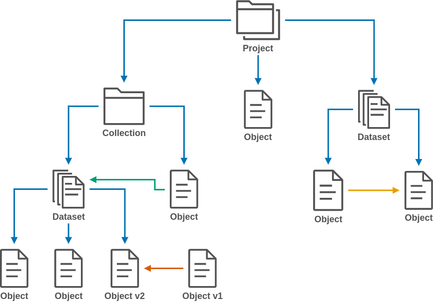

# Documentation

!!! Info "Release Info"

    **AOS version 2.0.x is still in beta phase but will be released soon. More information on [https://aruna-storage.org](https://aruna-storage.org){target="_blank"}.**

Welcome to the general documentation for the Aruna Object Storage (AOS).

This documentation includes theoretical concepts, the internal data structure, the entity-relationship model, a basic usage guide, some generic user story playbooks, and much more in the future.

Deeper technical documentation can be found in the implementation repositories for the [API](#aos-api), [Server](#aos-server), [Server](#aos-dataproxy).
Details on the individual structures can be found in the API documentation and/or the [Data Structure](internal_data_structure/internal_data_structure.md) part of this documentation.

## AOS Concept

The Aruna Object Storage (AOS) is implemented in Rust and provides multiple access methods for end users, such as a gRPC and JSON-over-REST API, as well as pre-built client libraries for multiple programming languages. The system uses an underlying distributed NewSQL database to manage detailed information about its [resources](#aruna-resources).  The database can be deployed across multiple data centers and scaled horizontally to keep pace with the growth of the data stored. Data submitted by users is stored using data proxies, which provide an S3-compatible API with additional functionality to abstract from existing storage infrastructures. This allows a variety of different academic computing and storage providers to be integrated into the system, enabling easy and automated offsite backups and site-local caches, while allowing participants to retain full data sovereignty.

<figure id="aruna-components" markdown>
  { align=center }
  <figcaption>Schematic overview of centralised and decentralised AOS components. The centralised AOS components handle authentication and authorisation by integrating existing IAM providers in combination with user-specific attributes (ABAC). The central components also provide a registry with meta-descriptions and locality information making records discoverable. The decentralised components consist of data proxy applications that expose existing data structures via a common S3 interface and enable data exchange and caching in a peer to peer network within and between participants.
.</figcaption>
</figure>

## AOS Components

<figure id="aruna-resources" markdown>
  { align=center }
  <figcaption markdown>chematic of a hierarchical structure of AOS resources. A more detailed description of the individual parts can be found [here](internal_data_structure/internal_data_structure.md).</figcaption>
</figure>

### **AOS API**

[:material-source-repository: **Github repo**](https://github.com/ArunaStorage/ArunaAPI){:target="_blank"}

> This repo contains the definitions of the Aruna Object Storage (AOS) API. It is written in the protocol-buffers interface definition language (IDL). This can be used to automatically generate clients in many different programming languages using the grpc framework.

> With the release of a new API version, the client libraries are automatically compiled and updated to the latest version.
> The API is fundamentally backwards compatible, which means that users' applications will continue to work as usual before they also decide to move to the new version.

* Rust API stubs: [GitHub](https://github.com/ArunaStorage/rust-api){:target="_blank"} or [crates.io](https://crates.io/crates/aruna-rust-api){:target="_blank"}
* Go API stubs: [GitHub](https://github.com/ArunaStorage/go-api){:target="_blank"}
* Python API stubs: [GitHub](https://github.com/ArunaStorage/python-api){:target="_blank"} or [PyPI](https://pypi.org/project/Aruna-Python-API){:target="_blank"}
* Java API stubs: [GitHub](https://github.com/ArunaStorage/java-api){:target="_blank"}

### **AOS Server**

[:material-source-repository: **Github repo**](https://github.com/ArunaStorage/ArunaServer){:target="_blank"}

The implementation of the API that handles the incoming requests.

> Aruna Object Storage is a geo-redundant data lake storage system that manages scientific data and a rich set of associated metadata according to FAIR principles.

>It supports multiple data storage backends (e.g. S3, File ...) via a DataProxy that exposes a S3-compatible interface.

> * FAIR, geo-redundant, data storage for multiple scientific domains
> * Organize your data objects in projects, collections and datasets
> * Flexible, file format and data structure independent metadata annotations via labels and dedicated metadata files (e.g schema.org)
> * Notification streams for all performed actions
> * Compatible with multiple (existing) data storage architectures (S3, File, ...)
> * S3-compatible API for pre-authenticated up- and download URLs
> * REST-API and dedicated client libraries for Python, Rust, Go and Java
> * (planned) integrated scheduling of external workflows for data validation and transformation

### **AOS DataProxy**

[:material-source-repository: **Github repo**](https://github.com/ArunaStorage/DataProxy){:target="_blank"}

> This is the internal server implementation handling the communication between the data storage backend used for the specific AOS instance.

> DataProxy is a subcomponent of Aruna Object Storage that provides a partially compatible S3 API for data storage with advanced features like encryption at REST, deduplication, and storage according to FAIR principles. Features

> * Partial S3 API compatibility: DataProxy implements a subset of the S3 API, making it easy to integrate with existing S3 clients and libraries.
> * Encryption at rest: all data stored in DataProxy is encrypted at rest, ensuring the confidentiality and integrity of your data.
> * Deduplication: DataProxy uses advanced deduplication algorithms to ensure that identical data is stored only once, reducing storage costs and improving performance.
> * FAIR principles: DataProxy adheres to the FAIR principles of data management, ensuring that your data is findable, accessible, interoperable and reusable.

<!--
### **AOS CLI**

[**Main Aruna CLI repository**](https://github.com/ArunaStorage/ArunaCLI){:target="_blank"}

> This is a simple CLI application for the ScienceObjectsDB API. 
> Its currently work in progress and will be developed along with the API. Neither concept nor implementation are final.
-->

## Implementation Design Trivia

- An RDBMS will be used as database backend for the AOS Server
- The AOS Server, Dataproxy nd CLI will be implemented in [Rust](https://www.rust-lang.org/){:target="_blank"}
- The base API interface will be defined using [Protocol Buffers](https://developers.google.com/protocol-buffers){:target="_blank"}
- All endpoints work with JSON over HTTP just as they do with requests made via gRPC from individual clients
- [Clients stubs](#aos-api) will be generated for major programming languages on every API release
- A [basic CLI client](https://github.com/ArunaStorage/ArunaCLI){:target="_blank"} will be offered to simplify the usage entry barrier
- A [web UI](https://web.aruna.nfdi-dev.gi.denbi.de/ui/){:target="_blank"} is available for demonstration purposes

